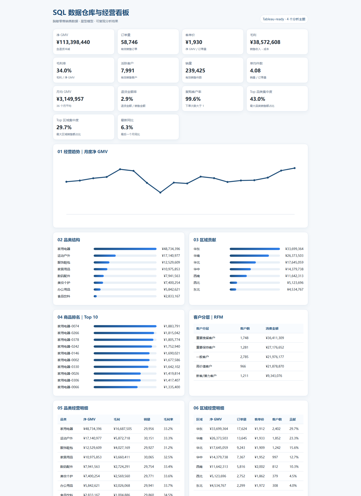
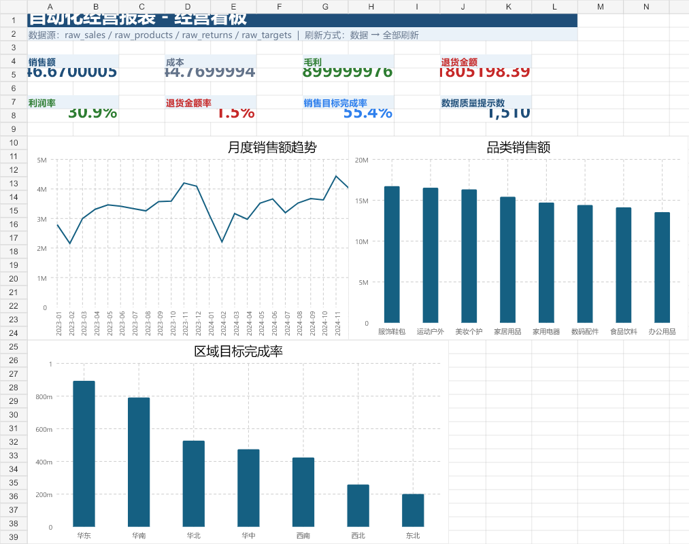
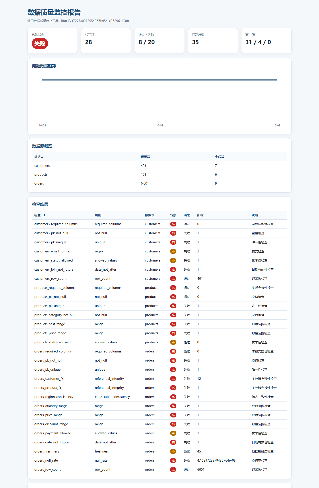

# 数据专员项目作品集

面向数据专员、业务数据分析和数据治理岗位的三个完整项目，包含可复现代码、脱敏数据、业务指标、可视化成品与自动化测试。

| 项目 | 技术栈 | 核心成果 |
|---|---|---|
| SQL 数据仓库 + Tableau 经营看板 | Python、SQLite、SQL、Tableau | 113,306 条事实数据、14 个 KPI、10 个 worksheet、4 个 dashboard |
| Excel + Power Query 自动化经营报表 | Excel、Power Query M、Python | 41,280 行事实表、6 条 M 查询、透视表、KPI 看板 |
| 通用数据质量监控 | Python、Pandas、SQLite、HTML | 28 项检查、35 个问题、问题闭环、HTML 报告 |

## SQL 数据仓库 + Tableau



- 日期、客户、商品和销售事实星型模型。
- GMV、订单量、客单价、毛利率、活跃客户、销量、单均件数、月均 GMV、退货率、复购率、集中度和同比。
- [高质感 PDF](docs/assets/dashboard_portfolio.pdf)
- [Tableau Professional](docs/assets/RetailSalesDashboard-Professional.twbx)

## Excel + Power Query



- 4 类数据源、6 条 Power Query M 查询。
- 自动清洗、合并、指标计算、数据透视和异常识别。
- [可刷新 Excel 工作簿](docs/assets/自动化经营报表-含PowerQuery.xlsx)

## 通用数据质量监控



- 空值、重复、格式、范围、主外键、跨表一致性和数据新鲜度。
- SQLite 历史留存、问题首次/最近出现和闭环状态。
- [在线 HTML 报告](docs/data-quality-report.html)

## GitHub Pages

启用仓库 Pages 后选择 `main` 分支的 `/docs` 目录，访问首页 `docs/index.html`。

## 本地运行

```powershell
$env:PYTHON_EXE = "C:\path\to\python.exe"
.\01_sql_dwh_tableau_dashboard\run.ps1
.\02_excel_power_query_report\run.ps1
.\03_data_quality_monitor\run.ps1
```

完整验收结果见 `ACCEPTANCE_REPORT.md`。